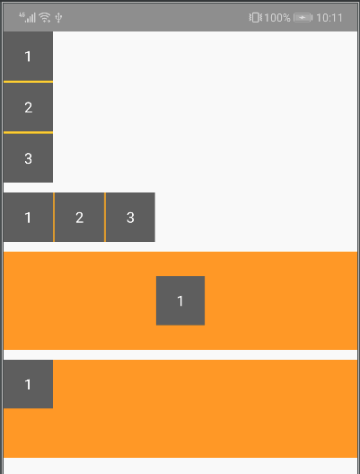
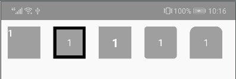
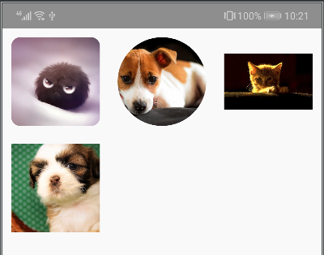

# 静态信息的动态化展示

- 静态信息：弱交互视图，单纯依赖视图表达产品需求。动态化：热更新+跨平台，及时+轻便。

## 实现思路

- 用json描述视图块+数据。服务端下发jsonView(描述视图块的json) + jsonData(数据)，客户端把jsonView解析成原生View，排列组合，数据绑定。

## 优缺点&应用场景

### 优点
- 热更新+跨平台，轻便，高性能。

### 缺点 
- 无法处理复杂强交互视图，动画。
- 通信方式单一，目前只支持回调点击事件。
- 只支持用json描述视图和数据。
- 只支持通用跳转+提前约束的事件回调

### 应用场景

#### 千人千面
- 不同用户下发不同视图布局

#### 视图预埋
- 客户端不用做视图预埋，由服务器动态下发

#### 解决需要频繁更新的视图块需求&广告位&推荐位
- 视图块如果需要频繁更新可以不依赖客户端版本

## 结构

### 1、DSL定义
- 布局属性：视图宽高 子布局的排队规则
- 视图属性：UI样式
- 数据属性：jsonView匹配jsonData中对应的节点数据
- 容器属性：定义根节点布局
- 交互属性：action:{} 定义点击事件
- 条件属性：可根据业务逻辑做单层条件判断
- 运算属性：可处理加减乘除

#### 通用属性
| 参数 | 说明 |
| ------ | ------ |
| width | |
| height | |
| padding | |
| padding-left | |
| padding-right | |
| padding-top | |
| padding-bottom| |
| margin | |
| margin-left | |
| margin-right | |
| margin-top | |
| margin-right | |
| margin-bottom | |
| border-width | |
| border-color | |
| border-radius | |
| border-top-left-radius | |
| border-top-right-radius | |
| border-bottom-left-radius | |
| border-bottom-right-radius | |
| background-color | |
| background-image | |

#### flexLayout特有属性
| 参数 | 说明 |
| ------ | ------ |
| type | view |
| flex-direction | |
| align-items | |
| justify-content | |
| flex-wrap | |
| flex | |
| children | |

#### imageView特有属性
| 参数 | 说明 |
| ------ | ------ |
| type | image |
| src | |
| scale-type | |

#### textView特有属性
| 参数 | 说明 |
| ------ | ------ |
| type | text |
| text | |
| font-size | |
| color | |
| font-weight | |
| text-align | |
| lines | |
| line-height | |

#### 条件属性示例
```json
"color": [
                {
                  "left": {
                    "value": "<?Items.0.ReviewCount?>"
                  },
                  "right": {
                    "value": "0"
                  },
                  "operation": ">",
                  "return": "#DC143C"
                },
                {
                  "return": "#0000FF"
                }
              ]
```
| 参数 | 说明 |
| ------ | ------ |
|  | |

#### 运算属性示例
```json
"text": {
                "left": "<?Items.0.ReviewCount?>",
                "right": "<?Items.0.ReviewCountValue?>",
                "math": "+"
              }
```

| 参数 | 说明 |
| ------ | ------ |
|  | |

### 2、动态视图管理
- 视图更新
- 版本兼容方案

### 3、视图构建表
- 翻译
- 解析器

### 4、数据绑定
- <??> 匹配jsonData中的节点

### 5、事件绑定
- action:{} 目前支持点击事件，回调action节点jsonString

## DEMO

- 目前支持flexBoxLayout、TextView、ImageView。
- 
- 
- 
